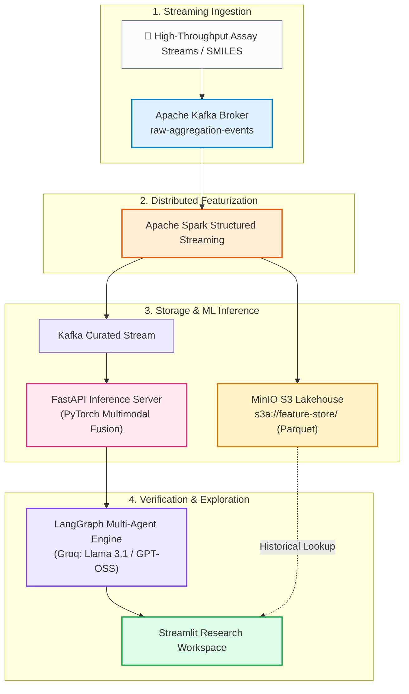

# Real-Time Multi-Modal Protein Aggregation & Drug-Target Screening Platform

An end-to-end distributed biochemical intelligence platform designed to evaluate small-molecule therapeutic candidates against protein targets, quantify aggregation inhibition, and profile drug-likeness in real time.

The system integrates **Apache Kafka** event streaming, **Apache Spark** distributed featurization, an S3-compatible **MinIO lakehouse**, a **PyTorch late-fusion neural network** inference service, and a cyclic **LangGraph** multi-agent scientific reasoning assistant.

### The Biological Bottleneck: Protein Aggregation
Pathological protein misfolding and fibrillar aggregation form the clinical hallmark of fatal neurodegenerative diseases:
- **Alzheimer’s Disease:** Amyloid-beta (Aβ₁₋₄₂) and Tau neurofibrillary tangles.
- **Parkinson’s Disease:** Alpha-Synuclein (α-Synuclein) forming toxic Lewy bodies.
- **ALS & Prion Disorders:** TDP-43 and PrP scrapie plaques.

In traditional biopharma pipelines, evaluating whether a novel small-molecule drug can bind to an unstructured, aggregation-prone protein and inhibit fibril nucleation requires months of slow wet-lab assays (Thioflavin-T fluorescence assays, Surface Plasmon Resonance, cryo-EM, and circular dichroism). High-throughput experimental screening of large chemical libraries is expensive, noisy, and produces high false-positive rates due to non-specific compound aggregation (PAINS).
### How This Platform Solves It

This project builds an automated, real-time in-silico triage pipeline that connects chemical streaming ingestion directly to deep learning inference and agentic hypothesis verification:

1. **Continuous Assay Telemetry Ingestion (Kafka + Spark):**
   Instead of waiting for static CSV or Excel assay outputs, plate-reader sensor readings and experimental streaming records are captured in micro-batches via Kafka and featurized live with Spark Structured Streaming, persisting directly into a columnar Parquet Lakehouse on MinIO.

2. **Multimodal Deep Learning Late-Fusion (PyTorch + RDKit):**
   The neural network simultaneously encodes:
   - **Small-Molecule Chemotype:** 1024-bit Morgan topological circular fingerprints ($r=2$) extracted with RDKit to represent atom neighborhoods, pharmacophores, and ring scaffolds.
   - **Target Protein Landscape:** Amino acid sequence composition and Kyte-Doolittle hydropathy vectors to identify solvent-exposed hydrophobic nucleation seeds.
   - **Physiological State:** pH, temperature, and compound concentration.
   The model infers binding kinetics and outputs an **inhibition activity score (%)** with a calibrated confidence metric in milliseconds.

3. **Autonomous Agentic Verification (LangGraph + Groq):**
   Instead of handing researchers raw, unexplained numbers, a cyclic multi-agent loop evaluates the chemical findings:
   - **Researcher Node:** Extracts candidate binding pockets and literature alignment.
   - **Critic/Verifier Node:** Evaluates pharmacokinetic red flags (e.g., PAINS motifs, extreme lipophilicity, insolubility).
   - **Synthesizer Node:** Produces peer-level mechanistic reasoning and recommends downstream experimental steps.

4. **Interactive Chemoinformatics Profiling (Streamlit):**
   Provides medicinal chemists with immediate visibility into 2D structural scaffolds, Lipinski Rule-of-Five compliance, Blood-Brain Barrier (BBB) permeability indicators, and structural anomaly warnings for beyond-the-rule-of-5 (bRo5) macrocycles (like Cyclosporine A).


### Real-World Time & Cost Savings

| Evaluation Stage | Traditional Wet-Lab & Manual Workflow | This Real-Time AI Streaming Platform | Time & Resource Saved |
| :--- | :--- | :--- | :--- |
| **Initial Library Screening** | 2–4 months of robotic high-throughput screening (HTS) costing $50k–$200k+ | **Milliseconds per compound** through streaming PyTorch inference | **> 95% reduction in wet-lab trial costs** |
| **Nucleation Hotspot Analysis** | Manual sequence alignment and multi-week MD simulations | **Instantaneous hydropathy mapping** across sequence residues | **Minutes vs. weeks** of HPC compute time |
| **Druggability & BBB Triage** | Separate in-vitro PAMPA/Caco-2 permeability assays | **Zero-click instant profiling** of TPSA, LogP, and CNS penetrance | Weeds out impermeable candidates **prior to synthesis** |
| **Hypothesis Verification** | Days of manual PubMed literature curation and assay reconciliation | **Autonomous multi-agent consensus** in seconds via LangGraph | **Accelerates hit-to-lead validation cycles by 10x** |


## Architecture Overview



## Core Features
- **Distributed Stream Processing:** Ingests biochemical assay telemetry via Kafka (`kafka:29092`) and calculates streaming chemical descriptors and windowed statistics using Spark Structured Streaming.
- **Lakehouse Storage:** Stores processed records in MinIO object storage (`s3a://feature-store/protein_drug_curated/`) in columnar Parquet format for fast analytical queries.
- **Multimodal PyTorch Model:** Implements a late-fusion neural architecture combining:
  - Small-molecule 1024-bit Morgan topological fingerprints ($r=2$) extracted via RDKit.
  - Normalized target amino acid composition and hydropathy embeddings.
- **Cyclic Agentic Validation:** Multi-agent reasoning pipeline built with LangGraph and served via Groq (`openai/gpt-oss-120b` / `llama-3.1`), providing iterative scientific critique, verification, and hypothesis testing.
- **Interactive Cheminformatics Workspace:**
  - 2D molecular graph rendering using RDKit.
  - Lipinski Rule-of-Five compliance scoring (MW, LogP, HBD, HBA, TPSA).
  - Blood-Brain Barrier (BBB) / CNS permeation window assessment.
  - Kyte-Doolittle residue hydropathy mapping to identify aggregation-prone nucleation seeds.
  - Beyond-the-Rule-of-5 (bRo5) detection for macrocyclic chameleons (e.g., Cyclosporine A).

## Tech Stack

| Domain | Tools & Frameworks |
| :--- | :--- |
| **Streaming & Processing** | Apache Kafka, Apache Spark Structured Streaming |
| **Storage / Lakehouse** | MinIO (S3-compatible Object Storage), Apache Parquet |
| **Machine Learning & Chemistry** | PyTorch, RDKit, NumPy, Pandas, Scikit-learn |
| **Serving & Infrastructure** | FastAPI, Uvicorn, Docker, Docker Compose, Pydantic |
| **Agentic AI & Orchestration** | LangGraph, LangChain, Groq Cloud API |
| **UI & Visualization** | Streamlit, Custom CSS |

## Project Structure

```text
Bio-Project/
├── .env.example                  # Environment template
├── requirements.txt              # Project Python dependencies
├── docker-compose.yml            # Kafka, Zookeeper, and MinIO definitions
├── models/
│   └── fusion_net.pt             # Trained PyTorch late-fusion weights
│
├── src/
│   ├── common/                   # Shared configurations and utilities
│   │   ├── config.py             # Pydantic base settings & env variables
│   │   └── logger.py             # Telemetry logging setup
│   │
│   ├── streaming/                # Distributed data streaming pipeline
│   │   ├── producer.py           # Synthetic biochemical assay stream generator
│   │   └── spark_pipeline.py     # Spark structured streaming & lakehouse sink
│   │
│   ├── serving/                  # Model inference and API layer
│   │   └── app.py                # FastAPI server (PyTorch inference endpoints)
│   │
│   ├── agent/                    # Multi-agent verification loop
│   │   ├── graph.py              # LangGraph cyclic state machine
│   │   └── nodes.py              # Researcher, Critic, and Synthesizer agents
│   │
│   └── ui/                       # Research dashboard
│       ├── app.py                # Main Streamlit dashboard entry point
│       ├── style/
│       │   └── custom.css        # Dashboard custom styling
│       └── components/
│           ├── chat_view.py      # Agentic chat interface
│           ├── assay_inspector.py# Real-time Kafka telemetry monitor
│           └── molecule_viewer.py# 2D RDKit viewer, Ro5 & hydropathy profiler
│
└── README.md
## Install dependencies
python -m venv .venv
source .venv/bin/activate
pip install -r requirements.txt

## Start Infrastrucute Services 
docker compose -f deploy/docker-compose/docker-compose.yml up -d

##Launch the Spark Streaming Engine:
python -m src.streaming.spark_pipeline

##Start the Mock Assay Stream Producer
python -m src.streaming.producer

##Start the FastAPI Model Server
uvicorn src.serving.app:app --host 0.0.0.0 --port 8000 --reload

##Launch the Streamlit Research Workspace
python -m streamlit run src/ui/app.py


### Clone the Repository
```bash
git clone [https://github.com/](https://github.com/)<your-username>/Bio-Project.git
cd Bio-Project
